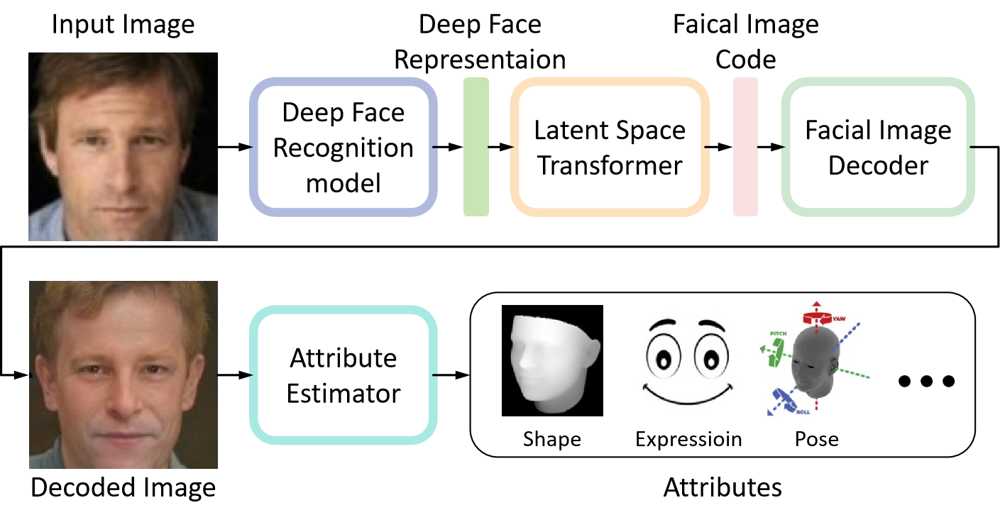

# Understanding Deep Face Representation via Attribute Decoding

Deep neural networks have proven to be highly effective in the face recognition task, as they can map raw samples into a high-dimensional representation space. However, understanding this complex space proves to be challenging for human observers. In this paper, we propose a novel approach that interprets deep face recognition models in terms of facial attributes. To achieve this, we introduce a two-stage framework that decodes attributes from the deep face representations. This framework allows us to quantitatively measure the significance of facial attributes in relation to the recognition model. Moreover, this framework enables us to generate image-specific explanations through the use of counterfactual samples. These explanations are not only understandable and quantitative but also offer both sufficiency and necessity. Through the proposed approach, we are able to acquire a deeper understanding of how the recognition model conceptualizes the notion of "identity" and understand the reasons behind errors the model may make. By utilizing attributes as an interpretable medium, the proposed method marks a paradigm shift in our comprehension of deep face recognition models. It allows a complex model, obtained through gradient backpropagation, to effectively "communicate" with humans.

## The proposed framework

